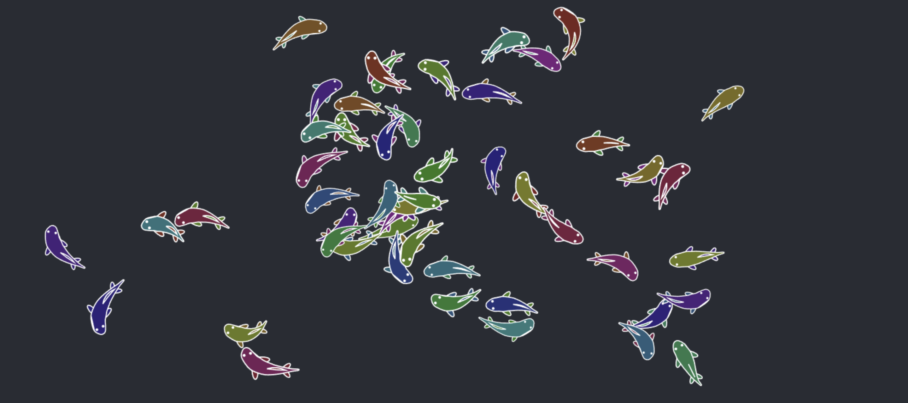
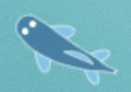
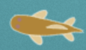
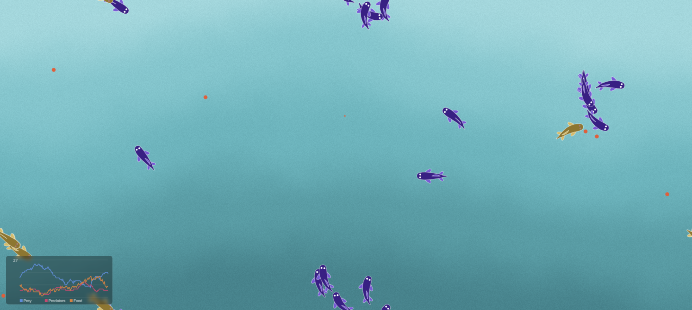

Siempre me ha fascinado la capacidad de simular escenarios verosímiles en medios digitales gracias a la computación y el modelaje de sistemas predecibles y basados en leyes conocidas (o desconocidas).

Existen muchos motivos útiles para simular un escenario en un programa digital, principalmente para predecir el comportamiento de un sistema dada configuración específica o unas condiciones determinadas. Algunos ejemplos que me vienen a la mente son:
- La simulación del comportamiento de un puente sobre el que pasa una cantidad de vehículos para saber si este será seguro antes de comenzar su construcción.
- El modelaje de un sistema de partículas según las leyes de la mecánica clásica.
- Una simulación del tráfico vehicular de una red de transporte para analizar, planificar y optimizar el flujo de vehículos en una ciudad.

Sin embargo, hay un tipo de simulación que, a día de hoy, me parece la más interesante. Esta es la **simulación de ecosistemas**.

## En qué se basa la simulación de un ecosistema?
La simulación de un ecosistema usa leyes de la computación y las matemáticas para recrear fenómenos naturales de interacción entre diferentes formas de vida, como la depredación, la reproducción, la alimentación, presas escapando de depredadores, propagación de genes, etc.
Me encanta este tipo de simulación porque permite visualizar la evolución de un conjunto de **agentes** (así se llama a las formas de vida o entidades en el método más común de simulación de ecosistema) en el tiempo, en un entorno donde las condiciones determinan los patrones y comportamientos que tendrán estos en todo momento.

Además de eso, este tipo de simulaciones no sirve únicamente para visualizar interacciones biológicas, sino que también permite observar comportamientos emergentes en entornos de **ciencias sociales** y **ecología**.
Aún así, en este blog me centraré únicamente en la simulación de ecosistemas biológicos mediante el modelo Lotka-Volterra, caracterizado por tener únicamente dos agentes: Una especie depredadora y una especie presa.

## Proyecto: Acuario web procedimental

Mientras investigaba sobre animación procedimental simple de cadenas y llegaba a un punto medianamente satisfactorio (los peces se movían de forma autónoma naturalmente), pensé en que, sin darme cuenta, había logrado la base que siempre he querido para formar una simulación biológica, que era tener agentes que se movieran y se vieran de una forma que no fuera directamente fea.
Así que decidí aprovechar y ponerme a implementar los elementos que faltaban para darle vida al entorno.

### Presas
En todo ecosistema biológico hay dos tipos de agentes: Las presas y los depredadores. Las presas se dedican a buscar alimento pasivo por el entorno (podemos pensar en plantas) y reproducirse para mantener la especie. Estas entidades suelen tener medios para escapar de sus depredadores, como correr más que ellos o tener más aguante físico. En mi simulación, simplemente tienen un _sprint_ para escapar de ellos.
En esta implementación, se diferenciarán de los depredadores por tener colores fríos y los ojos blancos.

### Depredadores
Los depredadores se alimentan a costa de las presas, y se dedican a buscarlas y darles caza, además de reproducirse también para aumentar su población.
En esta implementación, se diferenciarán de las presas por tener colores más cálidos y ojos oscuros.

### Comida
La comida aparece de forma arbitraria en el entorno, en el caso de mi simulación, esta aparece periódicamente en lugares aleatorios del espacio.

### Reproducción
Cuando un agente se reproduce, normalmente este pasa sus genes a la siguiente generación, con una ligera probabilidad de cambios (mutaciones). Estas mutaciones pueden ser positivas o negativas, y a la larga se podrá observar la dominancia de determinados genes superiores, como mayor aguante, velocidad, etc.
_Disclaimer_: En mi implementación no se han modelado las mutaciones genéticas por sencillez.

### Parámetros
Cada agente tiene un conjunto de parámetros que definen su comportamiento, entre estos pueden estar la velocidad, la agilidad, el metabolismo o el radio de escape, por ejemplo.
Buscar el valor apropiado de cada parámetro para encontrar un estado de la simulación que sea sostenible (es decir, que no se extinga ninguna de las especies) es complicado, porque los factores están altamente relacionados entre sí y ajustes pequeños pueden suponer cambios enormes en los resultados.

## Resultados

En estados estables de la simulación se puede apreciar perfectamente como la evolución de ambas poblaciones siguen un modelo caracterizado por oscilaciones entre el dominio de la población de presas y el dominio de la población de depredadores.
Esto es natural, porque, lógicamente, cuando hay abundante presa, los depredadores se multiplican rápidamente, y cuando la población de depredadores aumenta, la cantidad de presas disminuye debido al mayor peligro, lo que provoca que vuelva a bajar la población de depredadores, y así, idealmente, continuaría en un ciclo infinito.
También se puede observar la correlación entre la comida y la población de presas, que mantienen los niveles de comida disponible bajos cuando la población es alta y aumenta su disponibilidad cuando no hay tantas presas que la consuman.

Otro detalle que personalmente me fascina es la tendencia de las poblaciones a "converger" en uno o pocos colores con el tiempo, debido a que solo los colores de aquellos que han llegado a reproducirse prosperan. En esto se basa también la propagación de genes entre generaciones, aunque no he implementado variaciones genéticas en la reproducción por simplicidad.

### Desafíos
No me considero una persona precisamente artística ni con ojo para la apariencia estética de mis dibujos o elementos digitales, así que como era de esperar, conseguir unos peces con una apariencia aceptable me ha llevado tiempo de experimentación con diferentes formas, colores y aspectos hasta llegar al resultado final, el cual sinceramente sigue siendo mejorable, pero estoy satisfecho por ahora.

Otro reto difícil ha sido encontrar una configuración que pueda sostener el ecosistema durante un tiempo aceptable (~5 min). He ajustado casi una decena de parámetros, desde el comportamiento de los cazadores como el rango de búsqueda o la velocidad, pasando por el comportamiento de las presas como su rango de huida o su metabolismo, hasta la tasa de aparición de la comida en el entorno. Por ahora sigue siendo inestable a veces, debido a la aleatoriedad de factores como la distribución de los peces o la comida y la inteligencia limitada de los agentes, pero estoy satisfecho con el resultado.

Por último, la implementación del movimiento y las distancias 'toroidales' para que los agentes puedan atravesar los bordes apareciendo en la otra parte del mapa y también puedan detectar comida y otros agentes detrás de los bordes (de forma "circular") ha sido un ejercicio interesante de aritmética modular y geometría.

### Futuras implementaciones
Posiblemente en el futuro decida implementar la propagación de mutaciones a las nuevas generaciones, nuevos parámetros de comportamiento o incluso dotar de un motor de _Reinforcement Learning_ a los agentes para observar cómo emergen comportamientos inesperados condicionados por las condiciones del entorno. Esta última idea me llama bastante la atención.

### Consideraciones y conclusiones
Es importante considerar que, para conseguir el entorno más realista posible, se debería haber implementado mecánicas como que los depredadores puedan aumentar su velocidad durante un breve período de tiempo al perseguir a una presa, o restricciones como que para reproducirse debe ocurrir una interacción entre dos agentes de la misma especie (asumiendo que no se reproducen mediante métodos asexuales).
He decidido no recurrir a estas condiciones porque harían mucho más difícil encontrar el equilibrio del ecosistema, y me demandaría más tiempo del que estoy dispuesto a dedicar en este proyecto.

En general, he disfrutado mucho en el desarrollo de este experimento viendo como puedo modificar notablemente la evolución del sistema con pequeños cambios en parámetros que a simple vista no parecen tan determinantes, y sobre todo me encanta ver cómo un sistema marcado por unas leyes tan simples puede emerger sin mi intervención directa una vez que se pone en marcha.

